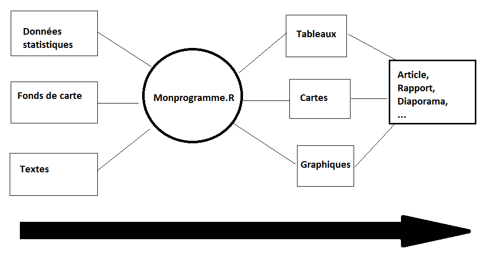
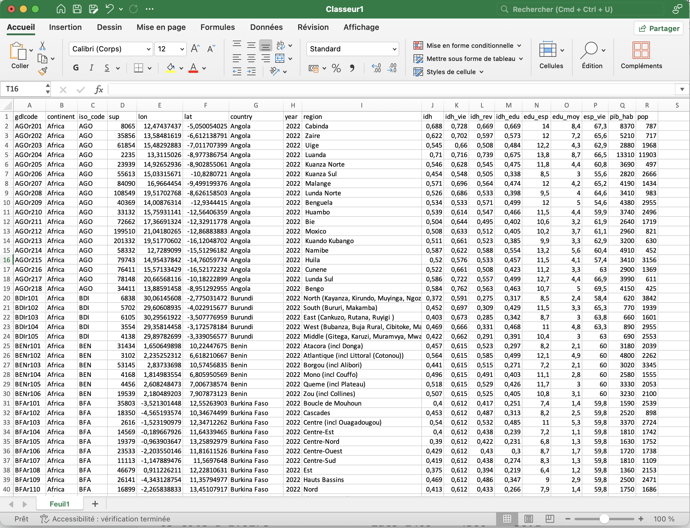
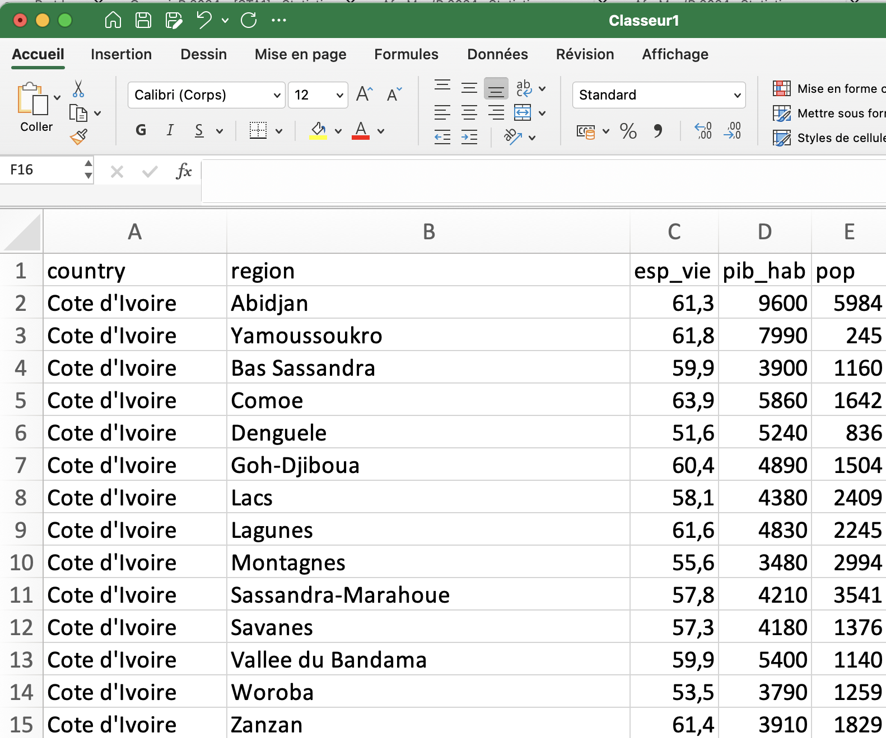
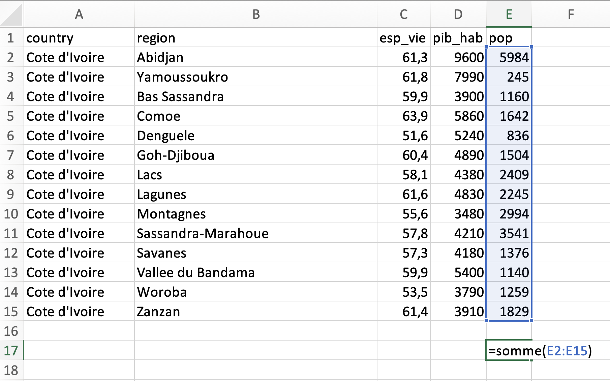
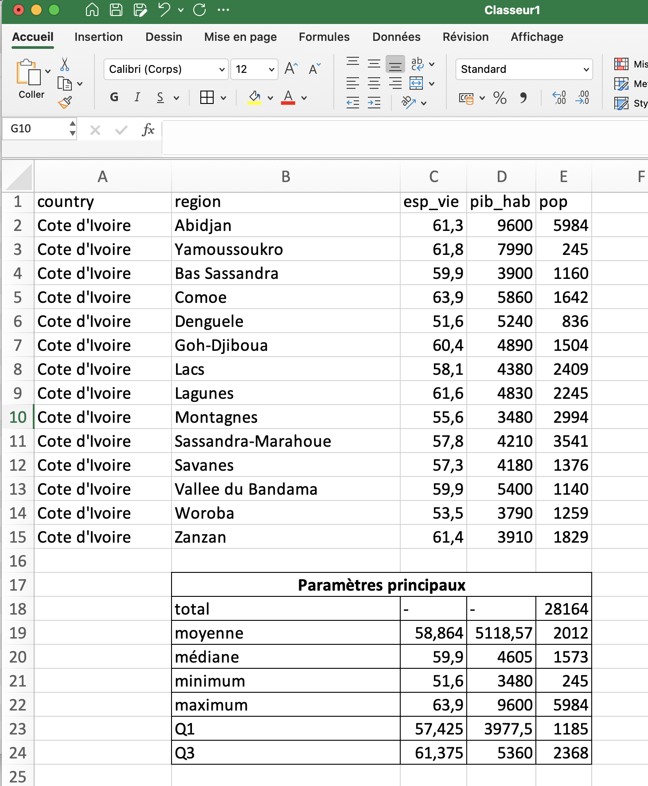
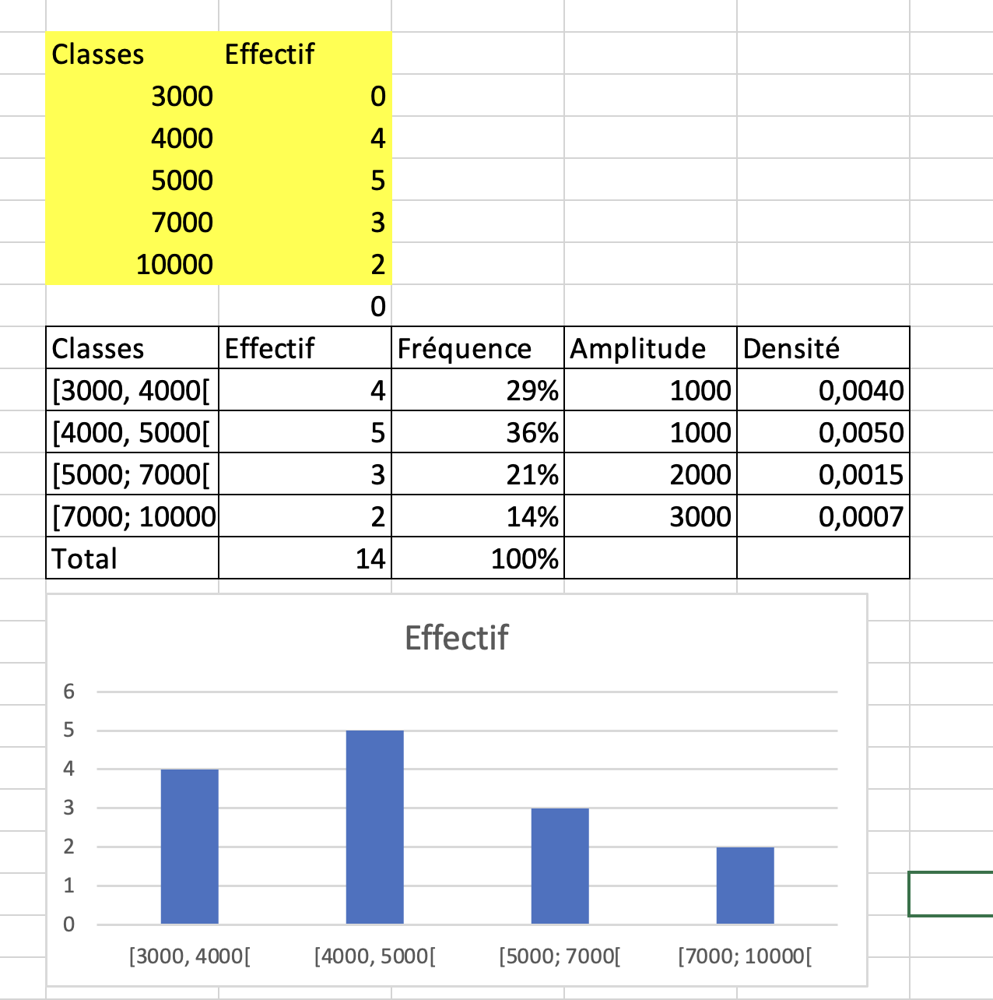
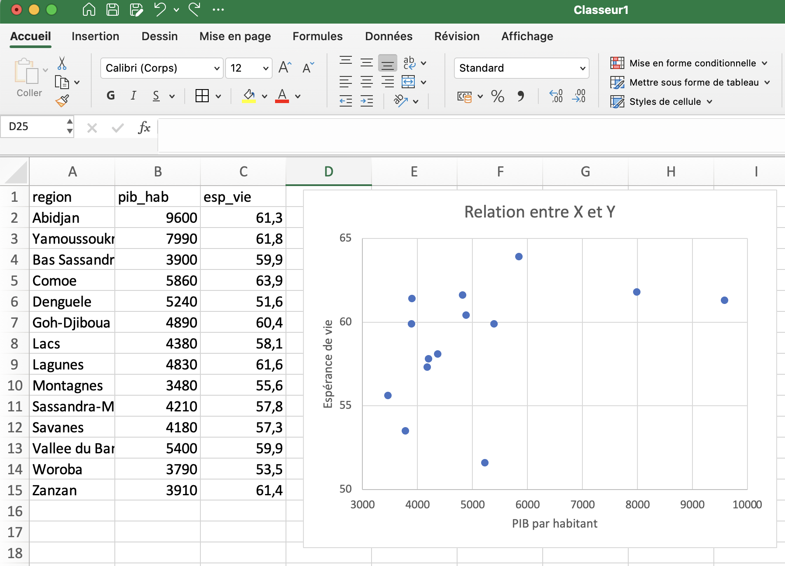
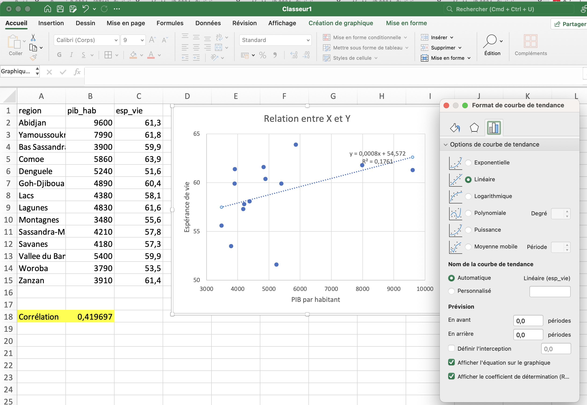

{width=800}


::: {.callout-tip}
## Télécharger l'exercice
-  [STAT0](https://github.com/worldregio/StatR/raw/refs/heads/main/exos/STAT0-markdown.zip)
:::

# Objectif 

Le but de ce chapitre est de montrer le plus tôt possible aux étudiants l'intérêt de réaliser des programmes R et de remplacer les logiciels de bureautique comme Excel ou Libre office  par un environnement de travail plus intégré et plus performant... à condition d'oublier la souris pour revenir au clavier !


# Projet R

Si l'on veut s'épargner bien des désagréments dans l'apprentissage de R, il faut prendre dès le départ de bonnes habitudes. Parmi celles-ci, l'une des plus importantes est le fait d'inscrire toujours son travail dans le cadre d'un **projet R** c'est-à-dire - en simplifiant beaucoup - un **répertoire de travail** contenant l'ensemble des données, programmes, résultats... que l'on pourra par la suite compresser, archiver et transmettre à quelqu'un d'autre. 

## Lancement de R studio

Sauf à être complètement masochiste, on n'utilise jamais **R** directement mais on lance d'abord l'interface **R-Studio** qui facilite conisdérablement l'ensemble des opérations et offre une gamme considérable de services. Il ne faut toutefois pas confondre les deux et il serait par exemple ridicule d'indiquer sur un CV en vue d'un emploi de statisticien que l'on sait utiliser R-studio en oubliant de préciser que l'on maîtrise R. 


## Création d'un projet 

Pour créer un projet on utilise le menus déroulant *File/new project/ ...* et on définit un dossier de notre ordinateur (existant ou à créer) qui contiendra le projet. Une fois l'opération effectuée, on pourra constater que ce dossier contient un fichier *xxx.Rproj* ou xxx est en principe le nom du dossier dans lequel vous avez stocké le projet.

Ce fichier contient toute une série d'informations dont nous ne parlerons pas dans ce cours d'initiation mais qui, pour faire simple, définissent un ensemble de réglages du logiciel et de préférences de l'utilisateur. 

Si vous fermez Rstudio (faites-le !) il vous suffira pour reprendre votre travail là où vous vous étiez arrêté :

- de lancer R-studio et de cliquer sur *File/open project/...* suivi du nom du fichier xxx.Rproj
- ou plus simplement encore de double cliquer sur le fichier xxx.Rproj ce qui lancera automatiquement Rstudio

Le dossier contenant votre projet R peut être organisé à votre convenance. Certains mettent tout les fichier pêle-mêle dans le dossier. D'autres préfèrent créer des sous-dossiers contenant des données, des programmes, des résultats, des figures. Vous déciderez à l'usage de ce qui vous convient le mieux, mais le point important est que **tout ce qui entre ou sort de vos programmes R doit être de préférence stocké dans le répertoire du projet**. 


# Programme R


La fonction initiale d'un langage de programmation comme R est ... de créer des **programmes** c'est-à-dire des ensembles d'instruction permettant d'accomplir une tâche à l'intérieur d'une chaîne de production. Dans le cas d'un logiciel spécialisé dans l'analyse statistique, il s'agira donc de partir de données (statistiques, géographiques, textuelles, ...) pour aboutir à des résultats prenant la forme de tableaux, cartes ou graphiques. Il ne s'agit donc en somme que d'une étape du travail de recherche où le principal avantage de R est d'**automatiser une tâche** et de faciliter sa **reproduction ultérieure** avec en arrière plan un objectif de **productivité** puisque l'ordinateur réalise en quelques millisecondes des tâches qui prendraient des heures avec un logiciel click-bouton de type Excel. 





## Comparer R et Excel

Prenons comme exemple la création d'un **rapport sur l'évolution des inégalités régionales de développement dans les pays d'Afrique**. On dispose pour cela d'une très grande base de donnée produite par le Global Data Lab qui fournit à la fois des données statistiques et des fonds de carte pour chaque pays d'Afrique en 1992, 2002, 2012 et 2022.

Deux candidats se présentent pour le poste :

- **Le candidat A** est un expert dans la manipulation du package Microsoft Office (Excel, Word, Power Point, ...) avec plus de 30 ans d'expérience. Il maîtrise également ArcGis pour faire des cartes qu'il retouche ensuite avec Adobe Illustrator.

- **Le candidat B** est un étudiant de Master ayant suivi une formation à R et Rstudio ainsi qu'au logiciel de cartographie Magrit.

L'auteur du rapport décide de les mettre en concurrence pour voir lequel des deux candidats est le plus efficace et prépare une série d'épreuves qui seront chronométrées.

::: {.callout-important title="Comment passer du clic à la programmation ?"}

- La plupart des étudiants ou des enseignants de sciences sociales ont appris très tôt à utiliser des logiciels fonctionnant avec une **souris** et un écran sur lequel on doit **cliquer** sur des menus. C'est par exemple le cas dans Excel, Stata, ArcGis, Word ...

- Avec R il faut apprendre à rédiger des **programmes** en se servant presqu'uniquement du **clavier** et en rédigeant des instructions dans un **langage** qui n'est pas facile à comprendre au début.

- **Organiser une compétition entre logiciels** est  sans doute la façon la plus efficace de convaincre les personnes habituées aux logiciels click-bouton de passer à la programmation. Il faut montrer que la programmation est **plus rapide**, **plus efficace** et surtout **reproductible**.

:::


## Etape 1 : Importation du tableau de données 


::: {.callout-note title="Objectif de l'étape"}
Au cours de cette étape vous allez ...

1. **Importer un tableau** de l'ensemble des pays africains en 2022 qui se trouve dans le fichier *don_reg_2022.csv* qui se trouve dans le dossier *africa_GDL/data/*.

2. **Sélectionner des lignes** correspondant à la Côte d'Ivoire.

3. **Sélectionner les colonnes** correspondant aux variables *pays*, *région*, *pop*, *pib_hab* et *esp_vie*.

4. **Afficher le tableau** résultant de ces opérations
:::

### Solution Excel

On importe le fichier.
{width=400}

Puis on supprime des lignes et des colonnes en se servant de la souris. 

{width=400}


### Solution R

On crée un programme R avec *File/New File/R Script* puis on l'enregistre avec *File/Save/ ...* suivi du nom du programme.

On rédige ensuite des lignes de code correspondant à chacune des opérations demandées

```{r}
# ETAPE1 : préparation des données

## 1.1 Importation du tableau
don <- read.table(file = "data/africa_GDL/data/don_reg_2022.csv",
                  header= TRUE,
                  dec=",",
                  sep =";")

## 1.2 Sélection du pays
sel <- don[don$iso_code=="CIV",]

## 1.3 Sélection des variables
sel <-sel[, c("country","region","pop","pib_hab","esp_vie")]

## 1.4 Affichage du tableau
sel

```

::: {.callout-tip title="Résultat de l'étape"}
A priori, la solution Excel est plus rapide.
:::

## Etape 2 :  Calcul de la population du pays


::: {.callout-note title="Objectif de l'étape"}

On souhaite calculer la population totale du pays en effectuant la somme de la colonne population.
:::


### Solution Excel

On se place en bas de la colonne **pop** et on écrit =SOMME() puis on sélectionne les cases avec la souris.

{width=400}


### Solution R

On tape juste une commande avec la fonction `sum()` et le nom de la variable

```{r sumpop}
## ETAPE 2 : Poids du pyas

sum(sel$pop)*1000
```

::: {.callout-tip title="Résultat de l'étape"}
Les deux solutions sont aussi rapides l'une que l'autre
:::


## Etape 3 :  Calcul des paramètres principaux 

::: {.callout-note title="Objectif de l'étape"}
On veut calculer les paramètres statistiques principaux des variables pop, pib_hab et esp_vie (moyenne, médiane, minimum, maximum, quartiles)
:::

### Solution Excel
On tape plusieurs fonctions pour effectuer chacun des calculs demandés en bas de l'une des colonnes. Puis on les recopie pour avoir les résultats des autres colonnes.

{width=400}

### Solution R

On tape juste la fonction `summary()`pour résumer tout le tableau.

```{r}
## ETAPE 3 : Paramètres principaux
summary(sel)
```

::: {.callout-tip title="Résultat de l'étape"}
R est beaucoup plus rapide qu'Excel. Mais on trouve les mêmes fonctionalités dans des logiciels comme stata ou spss.
:::

## Etape 4 : Distribution de X

::: {.callout-note title="Objectif de l'étape"}
On veut connaître la forme de la distribution du PIB par habitant pour savoir si elle est symétrique ou dissymétrique, unimodale ou bimodale et si elle comporte des valeurs exceptionnelles.
:::

### Solution Excel

Excel ne sait pas faire des histogrammes directement. Il faut donc créer des classes ce qui est très compliqué  [(voir ici)](https://www.youtube.com/watch?v=LyYizxLli2o). Puis faire un diagramme en colonne  mais  qui sera en général **faux** si les classes sont d'amplitudes inégales.

{width=400}


### Solution R

La fonction `hist()` permet de connaître rapidement la forme d'une distribution et fournit un histogramme **juste**.

```{r}
hist(sel$pib_hab, 
     breaks = c(3000,4000, 5000, 7000, 10000),
     main = "Histogramme",
     xlab = "PIB par habitant")
```

On peut évidemment améliorer ensuite les figures si l'on souhaite. Voici par exemple un programme pour combiner un histogramme, un diagramme de distribution et une densité de probabilité.


```{r}
## ETAPE 4 :Histogramme et boxplot de X

X<- sel$pib_hab
hist(X, 
     main="Histogramme",
     breaks = quantile(X,probs = c(0,0.25,0.5,0.75,1)),
     ylab= "Densité",
     xlab = "X = PIB par habitant",
     probability = T,
     col= "lightyellow",
      )
rug(X, 
    col="blue",
    lwd=3)
lines(density(X, bw=sd(X)/2),
      col="red",
      lwd=2,
      )

```

::: {.callout-tip title="Résultat de l'étape"}
R permet d'obtenir rapidement la réponse à la question mais la construction d'une belle figure prend du temps et semble difficile pour le débutant.
:::


## Etape 5 : Distribution de Y

::: {.callout-note title="Objectif de l'étape"}
On veut calculer un histogramme de l'espérance de vie.
:::

### Solution Excel

On reprend toutes les étapes précédentes ce qui demande beaucoup de clics. 

### Solution R

On recopie le programme et on modifie juste le choix de la variable et le titre.


```{r}

## ETAPE 5 : Histogramme de Y

Y <- sel$esp_vie
hist(Y, 
     main="Histogramme",
     breaks = quantile(Y,probs = c(0,0.25,0.5,0.75,1)),
     ylab= "Densité",
     xlab = "Y = Espérance de vie",
     probability = T,
     col= "lightyellow",
      )

rug(Y, 
    col="blue",
    lwd=3)

lines(density(Y, bw=sd(Y)/2),
      col="red",
      lwd=2,
      )
```


::: {.callout-tip title="Résultat de l'étape"}
Nous avons eu du mal à rédiger le premier programme. Mais désormais il suffit de le modifier légèrement pour l'appliquer à une autre variable. 
:::


## Etape 6 : Diagramme croisant X et Y

::: {.callout-note title="Objectif de l'étape"}
On veut construit un diagramme croisant le pib par habitangt (variable explicative) et l'espérance de vie (variable à expliquer) afin de visualiser l'existence éventuelle d'une relation. Ajouter si possible le nom des régions
:::


### Solution Excel

On choisit le menu Graphique et on sélectionne le type "XY".

{width=400}

Puis, si on connaît bien Excel on ajoute des étiquettes pour avoir le nom des régions. 

### Solution R

On utilise la fonction `plot()` et on lui indique le nom des deux variables.

```{r}
plot(sel$pib_hab,sel$esp_vie)
```


On peut ensuite améliorer le résultat en ajoutant des titres aux axes, en modifiant la forme et la couleur des points, en ajoutant une grille, etc. 

```{r}
## ETAPE 6 : Relation entre X et Y 

plot(sel$pib_hab,sel$esp_vie,
     xlab = "X : PIB par habitant",
     ylab = "Y : Espérance de vie",
     main = "Relation entre X et Y",
     pch=20,
     col="red")

text(sel$pib_hab,sel$esp_vie,sel$region,
     cex=0.4,
     col="blue",
     pos=1)

grid()


```


::: {.callout-tip title="Résultat de l'étape"}
Excel semble plus simple d'utilisation mais en réalité faire un graphique prend beaucoup de temps. Les graphiques R sont assez faciles à maîtriser avec un peu d'habitude et on peut les exporter en haute définiton (.pdf). Il existe par ailleurs des packages graphiques très puissants dans R comme **ggplot2**.
:::

## ETAPE 7 : Relation entre X et Y

::: {.callout-note title="Objectif de l'étape"}
On veut mesurer la corrélation entre les variables X et Y puis tester si elle est significative.  Puis calculer l'equation de la droite de régression Y = aX+b et la tracer sur le graphique.
:::

### Solution dans Excel

Pour la corrélation on peut utiliser la fonction COR. Pour la droite de régression, on peut effectuer un clic sur le graphique XY et demander d'ajouter la droite de régression et son équation. 

{width=400}

Par contre il n'y a pas de test prévu pour savoir si la relation est significative. 

### Solution dans R

Les fonctions `cor()`, `cor.test()` et `lm()` permettent respectivement de mesurer la corrélation, la tester et calculer la droite de régression.


```{r}

## ETAPE 7 : Test de la relation entre X et Y

## 7.1 Corrélation
cor(sel$pib_hab,sel$esp_vie)

## 7.2 Test de significativité
cor.test(sel$pib_hab,sel$esp_vie)

## 7.3 Régression
modreg<-lm(esp_vie~pib_hab,data=sel)
summary(modreg)

## 7.4 Graphique + droite de régression


plot(sel$pib_hab,sel$esp_vie,
     xlab = "X : PIB par habitant",
     ylab = "Y : Espérance de vie",
     main = "Relation entre X et Y",
     pch=20,
     col="red")

text(sel$pib_hab,sel$esp_vie,sel$region,
     cex=0.4,
     col="blue",
     pos=1)

grid()

abline(modreg, col="black",lwd=2)


```


::: {.callout-tip title="Résultat de l'étape"}
Même si on est un expert en Excel, il est difficile de produire des résultats aussi précis que ceux fournis par R qui est le meilleur logiciel de statistique au monde. 
:::

# Efficacité et reproductibilité


Mais le véritable avantage de R réside dans la possibilité de réutiliser à plusieurs reprises un même programme en changeant juste les données iniiales


## Changement de date

On reprend tout notre programme et on remplace juste le fichier *don_reg_2022.csv* par le fichier *don_reg_2012.csv* qui fournit les mêmes données mais pour l'année 2012 au lieu de 2022.

```{r, eval=FALSE}
# ETAPE1 : préparation des données

## 1.1 Importation du tableau
don <- read.table(file = "data/africa_GDL/data/don_reg_2012.csv",
                  header= TRUE,
                  dec=",",
                  sep =";")

## 1.2 Sélection du pays
sel <- don[don$iso_code=="CIV",]

## 1.3 Sélection des variables
sel <-sel[, c("country","region","pop","pib_hab","esp_vie")]

## 1.4 Affichage du tableau
sel

## ETAPE 2 : Poids du pyas

sum(sel$pop)*1000

## ETAPE 3 : Paramètres principaux
summary(sel)


## ETAPE 4 :Histogramme et boxplot de X

X<- sel$pib_hab
hist(X, 
     main="Histogramme",
     breaks = quantile(X,probs = c(0,0.25,0.5,0.75,1)),
     ylab= "Densité",
     xlab = "X = PIB par habitant",
     probability = T,
     col= "lightyellow",
      )
rug(X, 
    col="blue",
    lwd=3)
lines(density(X, bw=sd(X)/2),
      col="red",
      lwd=2,
      )

## ETAPE 5 : Histogramme de Y

Y <- sel$esp_vie
hist(Y, 
     main="Histogramme",
     breaks = quantile(Y,probs = c(0,0.25,0.5,0.75,1)),
     ylab= "Densité",
     xlab = "Y = Espérance de vie",
     probability = T,
     col= "lightyellow",
      )

rug(Y, 
    col="blue",
    lwd=3)

lines(density(Y, bw=sd(Y)/2),
      col="red",
      lwd=2,
      )

## ETAPE 6 : Relation entre X et Y 

plot(sel$pib_hab,sel$esp_vie,
     xlab = "X : PIB par habitant",
     ylab = "Y : Espérance de vie",
     main = "Relation entre X et Y",
     pch=20,
     col="red")

text(sel$pib_hab,sel$esp_vie,sel$region,
     cex=0.4,
     col="blue",
     pos=1)

grid()


## ETAPE 7 : Test de la relation entre X et Y

## 7.1 Corrélation
cor(sel$pib_hab,sel$esp_vie)

## 7.2 Test de significativité
cor.test(sel$pib_hab,sel$esp_vie)

## 7.3 Régression
modreg<-lm(esp_vie~pib_hab,data=sel)
summary(modreg)

## 7.4 Graphique + droite de régression


plot(sel$pib_hab,sel$esp_vie,
     xlab = "X : PIB par habitant",
     ylab = "Y : Espérance de vie",
     main = "Relation entre X et Y",
     pch=20,
     col="red")

text(sel$pib_hab,sel$esp_vie,sel$region,
     cex=0.4,
     col="blue",
     pos=1)

grid()

abline(modreg, col="black",lwd=2)


```


```{r, echo=FALSE}
# ETAPE1 : préparation des données

## 1.1 Importation du tableau
don <- read.table(file = "data/africa_GDL/data/don_reg_2012.csv",
                  header= TRUE,
                  dec=",",
                  sep =";")

## 1.2 Sélection du pays
sel <- don[don$iso_code=="CIV",]

## 1.3 Sélection des variables
sel <-sel[, c("country","region","pop","pib_hab","esp_vie")]

## 1.4 Affichage du tableau
sel

## ETAPE 2 : Poids du pyas

sum(sel$pop)*1000

## ETAPE 3 : Paramètres principaux
summary(sel)


## ETAPE 4 :Histogramme et boxplot de X

X<- sel$pib_hab
hist(X, 
     main="Histogramme",
     breaks = quantile(X,probs = c(0,0.25,0.5,0.75,1)),
     ylab= "Densité",
     xlab = "X = PIB par habitant",
     probability = T,
     col= "lightyellow",
      )
rug(X, 
    col="blue",
    lwd=3)
lines(density(X, bw=sd(X)/2),
      col="red",
      lwd=2,
      )

## ETAPE 5 : Histogramme de Y

Y <- sel$esp_vie
hist(Y, 
     main="Histogramme",
     breaks = quantile(Y,probs = c(0,0.25,0.5,0.75,1)),
     ylab= "Densité",
     xlab = "Y = Espérance de vie",
     probability = T,
     col= "lightyellow",
      )

rug(Y, 
    col="blue",
    lwd=3)

lines(density(Y, bw=sd(Y)/2),
      col="red",
      lwd=2,
      )

## ETAPE 6 : Relation entre X et Y 

plot(sel$pib_hab,sel$esp_vie,
     xlab = "X : PIB par habitant",
     ylab = "Y : Espérance de vie",
     main = "Relation entre X et Y",
     pch=20,
     col="red")

text(sel$pib_hab,sel$esp_vie,sel$region,
     cex=0.4,
     col="blue",
     pos=1)

grid()


## ETAPE 7 : Test de la relation entre X et Y

## 7.1 Corrélation
cor(sel$pib_hab,sel$esp_vie)

## 7.2 Test de significativité
cor.test(sel$pib_hab,sel$esp_vie)

## 7.3 Régression
modreg<-lm(esp_vie~pib_hab,data=sel)
summary(modreg)

## 7.4 Graphique + droite de régression


plot(sel$pib_hab,sel$esp_vie,
     xlab = "X : PIB par habitant",
     ylab = "Y : Espérance de vie",
     main = "Relation entre X et Y",
     pch=20,
     col="red")

text(sel$pib_hab,sel$esp_vie,sel$region,
     cex=0.4,
     col="blue",
     pos=1)

grid()

abline(modreg, col="black",lwd=2)


```


## Changement de pays

On remplace reprend la date de 2022 mais on remplace la Côte d'Ivoire (CIV) par le Nigéria (NGA)

```{r, eval=FALSE}
# ETAPE1 : préparation des données

## 1.1 Importation du tableau
don <- read.table(file = "data/africa_GDL/data/don_reg_2022.csv",
                  header= TRUE,
                  dec=",",
                  sep =";")

## 1.2 Sélection du pays
sel <- don[don$iso_code=="NGA",]

## 1.3 Sélection des variables
sel <-sel[, c("country","region","pop","pib_hab","esp_vie")]

sel

## ETAPE 2 : Somme des populations

sum(sel$pop)*1000

## ETAPE 3 : Paramètres principaux
summary(sel[,c("pop","pib_hab","esp_vie")])

## ETAPE 4 :Histogramme de X

X<- sel$pib_hab
hist(X, 
     main="Histogramme",
     breaks = quantile(X,probs = c(0,0.25,0.5,0.75,1)),
     ylab= "Densité",
     xlab = "X = PIB par habitant",
     probability = T,
     col= "lightyellow",
      )

rug(X, 
    col="blue",
    lwd=3)

lines(density(X, bw=sd(X)/2),
      col="red",
      lwd=2,
      )

## ETAPE 5 : Histogramme de Y

Y <- sel$esp_vie
hist(Y, 
     main="Histogramme",
     breaks = quantile(Y,probs = c(0,0.25,0.5,0.75,1)),
     ylab= "Densité",
     xlab = "Y = Espérance de vie",
     probability = T,
     col= "lightyellow",
      )

rug(Y, 
    col="blue",
    lwd=3)

lines(density(Y, bw=sd(Y)/2),
      col="red",
      lwd=2,
      )

## ETAPE 6 : Relation entre X et Y 

plot(sel$pib_hab,sel$esp_vie,
     xlab = "X : PIB par habitant",
     ylab = "Y : Espérance de vie",
     main = "Relation entre X et Y",
     pch=20,
     col="red")
text(sel$pib_hab,sel$esp_vie,sel$region,
     cex=0.4,
     col="blue",
     pos=1)


## ETAPE 7 : Test de la relation entre X et Y

## 7.1 Corrélation
cor(sel$pib_hab,sel$esp_vie)

## 7.2 Test de significativité
cor.test(sel$pib_hab,sel$esp_vie)

## 7.3 Régression
modreg<-lm(esp_vie~pib_hab,data=sel)
summary(modreg)

## 7.4 Graphique + droite de régression


plot(sel$pib_hab,sel$esp_vie,
     xlab = "X : PIB par habitant",
     ylab = "Y : Espérance de vie",
     main = "Relation entre X et Y",
     pch=20,
     col="red")

text(sel$pib_hab,sel$esp_vie,sel$region,
     cex=0.4,
     col="blue",
     pos=1)

grid()

abline(modreg, col="black",lwd=2)


```


```{r, echo=FALSE}
# ETAPE1 : préparation des données

## 1.1 Importation du tableau
don <- read.table(file = "data/africa_GDL/data/don_reg_2022.csv",
                  header= TRUE,
                  dec=",",
                  sep =";")

## 1.2 Sélection du pays
sel <- don[don$iso_code=="NGA",]

## 1.3 Sélection des variables
sel <-sel[, c("country","region","pop","pib_hab","esp_vie")]

sel

## ETAPE 2 : Somme des populations

sum(sel$pop)*1000

## ETAPE 3 : Paramètres principaux
summary(sel[,c("pop","pib_hab","esp_vie")])

## ETAPE 4 :Histogramme de X

X<- sel$pib_hab
hist(X, 
     main="Histogramme",
     breaks = quantile(X,probs = c(0,0.25,0.5,0.75,1)),
     ylab= "Densité",
     xlab = "X = PIB par habitant",
     probability = T,
     col= "lightyellow",
      )

rug(X, 
    col="blue",
    lwd=3)

lines(density(X, bw=sd(X)/2),
      col="red",
      lwd=2,
      )

## ETAPE 5 : Histogramme de Y

Y <- sel$esp_vie
hist(Y, 
     main="Histogramme",
     breaks = quantile(Y,probs = c(0,0.25,0.5,0.75,1)),
     ylab= "Densité",
     xlab = "Y = Espérance de vie",
     probability = T,
     col= "lightyellow",
      )

rug(Y, 
    col="blue",
    lwd=3)

lines(density(Y, bw=sd(Y)/2),
      col="red",
      lwd=2,
      )

## ETAPE 6 : Relation entre X et Y 

plot(sel$pib_hab,sel$esp_vie,
     xlab = "X : PIB par habitant",
     ylab = "Y : Espérance de vie",
     main = "Relation entre X et Y",
     pch=20,
     col="red")
text(sel$pib_hab,sel$esp_vie,sel$region,
     cex=0.4,
     col="blue",
     pos=1)


## ETAPE 7 : Test de la relation entre X et Y

## 7.1 Corrélation
cor(sel$pib_hab,sel$esp_vie)

## 7.2 Test de significativité
cor.test(sel$pib_hab,sel$esp_vie)

## 7.3 Régression
modreg<-lm(esp_vie~pib_hab,data=sel)
summary(modreg)

## 7.4 Graphique + droite de régression


plot(sel$pib_hab,sel$esp_vie,
     xlab = "X : PIB par habitant",
     ylab = "Y : Espérance de vie",
     main = "Relation entre X et Y",
     pch=20,
     col="red")

text(sel$pib_hab,sel$esp_vie,sel$region,
     cex=0.4,
     col="blue",
     pos=1)

grid()

abline(modreg, col="black",lwd=2)


```


## Changement de niveau

On peut également charger un fichier de niveau supérieur où les données sont au niveau des pays plutôt que des entités infra-nationales.  On remplace juste le nom des régions par le code iso des pays

```{r, eval=FALSE}
# ETAPE1 : préparation des données

## 1.1 Importation du tableau
don <- read.table(file = "data/africa_GDL/data/don_sta_2022.csv",
                  header= TRUE,
                  dec=",",
                  sep =";")


## 1.3 Sélection des variables
sel <-don[, c("country","iso_code","pop","pib_hab","esp_vie")]

sel

## ETAPE 2 : Somme des populations

sum(sel$pop)*1000

## ETAPE 3 : Paramètres principaux
summary(sel[,c("pop","pib_hab","esp_vie")])

## ETAPE 4 :Histogramme de X

X<- sel$pib_hab
hist(X, 
     main="Histogramme",
     breaks = quantile(X,probs = c(0,0.25,0.5,0.75,1)),
     ylab= "Densité",
     xlab = "X = PIB par habitant",
     probability = T,
     col= "lightyellow",
      )

rug(X, 
    col="blue",
    lwd=3)

lines(density(X, bw=sd(X)/2),
      col="red",
      lwd=2,
      )

## ETAPE 5 : Histogramme de Y

Y <- sel$esp_vie
hist(Y, 
     main="Histogramme",
     breaks = quantile(Y,probs = c(0,0.25,0.5,0.75,1)),
     ylab= "Densité",
     xlab = "Y = Espérance de vie",
     probability = T,
     col= "lightyellow",
      )

rug(Y, 
    col="blue",
    lwd=3)

lines(density(Y, bw=sd(Y)/2),
      col="red",
      lwd=2,
      )

## ETAPE 6 : Relation entre X et Y 

plot(sel$pib_hab,sel$esp_vie,
     xlab = "X : PIB par habitant",
     ylab = "Y : Espérance de vie",
     main = "Relation entre X et Y",
     pch=20,
     col="red")
text(sel$pib_hab,sel$esp_vie,sel$iso_code,
     cex=0.4,
     col="blue",
     pos=1)


## ETAPE 7 : Test de la relation entre X et Y

## 7.1 Corrélation
cor(sel$pib_hab,sel$esp_vie)

## 7.2 Test de significativité
cor.test(sel$pib_hab,sel$esp_vie)

## 7.3 Régression
modreg<-lm(esp_vie~pib_hab,data=sel)
summary(modreg)

## 7.4 Graphique + droite de régression


plot(sel$pib_hab,sel$esp_vie,
     xlab = "X : PIB par habitant",
     ylab = "Y : Espérance de vie",
     main = "Relation entre X et Y",
     pch=20,
     col="red")

text(sel$pib_hab,sel$esp_vie,sel$iso_code,
     cex=0.4,
     col="blue",
     pos=1)

grid()

abline(modreg, col="black",lwd=2)


```


```{r, echo=FALSE}
# ETAPE1 : préparation des données

## 1.1 Importation du tableau
don <- read.table(file = "data/africa_GDL/data/don_sta_2022.csv",
                  header= TRUE,
                  dec=",",
                  sep =";")


## 1.3 Sélection des variables
sel <-don[, c("country","iso_code","pop","pib_hab","esp_vie")]

sel

## ETAPE 2 : Somme des populations

sum(sel$pop)*1000

## ETAPE 3 : Paramètres principaux
summary(sel[,c("pop","pib_hab","esp_vie")])

## ETAPE 4 :Histogramme de X

X<- sel$pib_hab
hist(X, 
     main="Histogramme",
     breaks = quantile(X,probs = c(0,0.25,0.5,0.75,1)),
     ylab= "Densité",
     xlab = "X = PIB par habitant",
     probability = T,
     col= "lightyellow",
      )

rug(X, 
    col="blue",
    lwd=3)

lines(density(X, bw=sd(X)/2),
      col="red",
      lwd=2,
      )

## ETAPE 5 : Histogramme de Y

Y <- sel$esp_vie
hist(Y, 
     main="Histogramme",
     breaks = quantile(Y,probs = c(0,0.25,0.5,0.75,1)),
     ylab= "Densité",
     xlab = "Y = Espérance de vie",
     probability = T,
     col= "lightyellow",
      )

rug(Y, 
    col="blue",
    lwd=3)

lines(density(Y, bw=sd(Y)/2),
      col="red",
      lwd=2,
      )

## ETAPE 6 : Relation entre X et Y 

plot(sel$pib_hab,sel$esp_vie,
     xlab = "X : PIB par habitant",
     ylab = "Y : Espérance de vie",
     main = "Relation entre X et Y",
     pch=20,
     col="red")
text(sel$pib_hab,sel$esp_vie,sel$iso_code,
     cex=0.4,
     col="blue",
     pos=1)


## ETAPE 7 : Test de la relation entre X et Y

## 7.1 Corrélation
cor(sel$pib_hab,sel$esp_vie)

## 7.2 Test de significativité
cor.test(sel$pib_hab,sel$esp_vie)

## 7.3 Régression
modreg<-lm(esp_vie~pib_hab,data=sel)
summary(modreg)

## 7.4 Graphique + droite de régression


plot(sel$pib_hab,sel$esp_vie,
     xlab = "X : PIB par habitant",
     ylab = "Y : Espérance de vie",
     main = "Relation entre X et Y",
     pch=20,
     col="red")

text(sel$pib_hab,sel$esp_vie,sel$iso_code,
     cex=0.4,
     col="blue",
     pos=1)

grid()

abline(modreg, col="black",lwd=2)


```