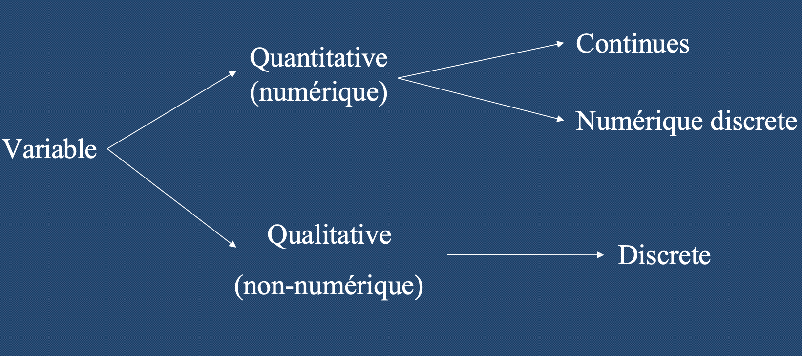
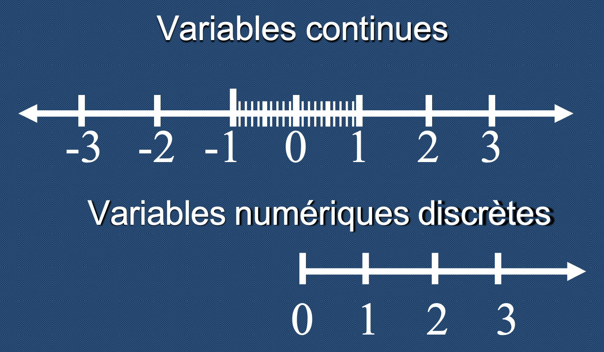
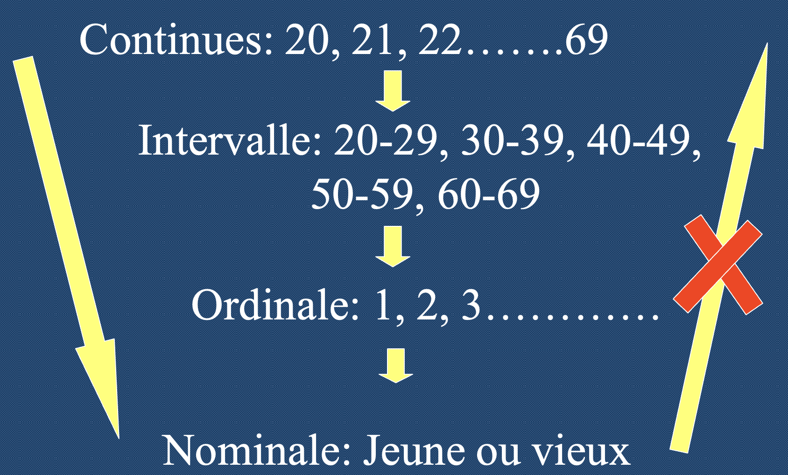
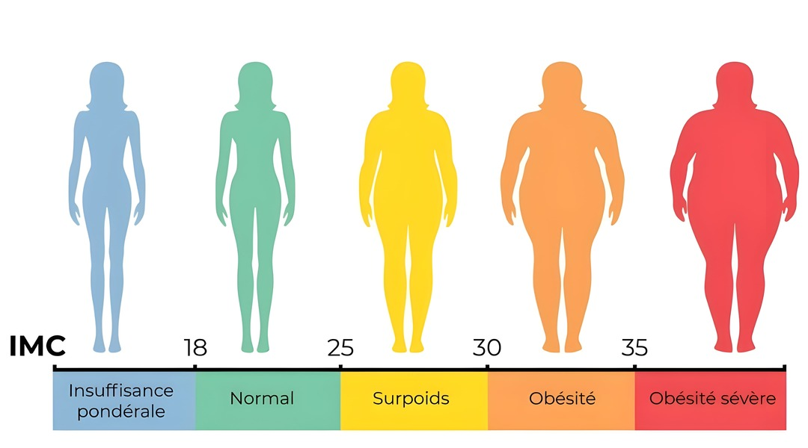

```{r}
library(knitr)
library(dplyr)
library(questionr)
```


## Objectifs du cours

- Comprendre le concept de variable
- Distinguer les types de variables
- Faire une transformation appropriée des données
- Presenter les données d’une manière convenable

# LE CONCEPT DE VARIABLE

## Définition

**VARIABLE = VARIE + ABLE = PEUT VARIER**

*"Une variable est une quantité qui varie d’un sujet à un autre. Tout attribut, phenomène ou évenement qui peut prendre différentes valeurs”*

La valeur que nous collectons chez un sujet est appelée **“DONNEE”**

## Informations fournies par les variables

1. **attribut indiviue**l : âge, sexe, statut matrimonial, profession, niveau socio- 	economique, etc.
2. **attribut spatial** : localisation géographique (region, pays, ville), milieu (urbaine ou rural), etc.
3. **attribut temporel** : heure (jour/nuit),  date (jour, mois, année), saison, durée (en heures, en jours, 	en mois, en année), etc.

## Exemple pédagogique

Nous pouvons demander aux étudiants qui suivent le cours de statistique de donner (de façon anonyme) leurs

- Age
- Sexe
- Statut matrimonial
- Lieu de residence
- Poids
- Taille

## Les femmes du Bénin en 2018 (données)

Nous avons extrait de l'*enquête DHS du Bénin de 2018* les caractéristiques de 4617 femmes ayant au moins un enfant. Le tableau se présente comme suit

```{r}
# Charge le fichier
tab<-readRDS("data/DHS-Benin-2018/femmes_2018.RDS")

# Affiche les 3 premières lignes
kable(head(tab,3))

# Affiche les 3 dernières lignes
kable(tail(tab,3))

```

Le tableau comporte 4617 **individus** décrits par 7 **variables** et rassemble 4617 x 7 = 32319 **valeurs**. 


## Les femmes du Bénin en 2018 (métadonnées)

- *poids* : poids de la femme en kilogrammes
- *taille* : taille de la femme en centimètres
- *age* : âge de la femme en années révolues
- *region* : département de localisation au moment de l'enquête (10 modalités)
- *milieu* : type de milieu urbain ou rural
- *educ* : nombre d'années de scolarisation (0 à 17)
- *nbenf* : nombre d'enfants au moment de l'enquête

**Source** : *Data and Health Survey (DHS)*, 2018.

# LES TYPES DE VARIABLES

## Typologie initiale

La première distinction oppose les variables **quantitatives** (numériques) et **qualitatives** (non-numériques). Puis on distingue les variables **discrètes** (modalités finies) et **continues** modalités infinies)



## Les variables quantitatives

- Une variable est dite quantitative si ses valeurs sont des variables numeriques, c'est à dire **des chiffres ou des nombres**.
- Ce sont des données sur lesquelles l’on peut appliquer des opérations mathematiques telles que la **somme**, la **moyenne**, etc. 
- Les variables quantitatives peuvent être **continues** ou **discrètes** 


## Quantitatives continues ou discrètes ?

Les variables quantitatives continues font parties de l'ensemble des **nombres réels $\mathbb{R}$** tandis que les variables numériques discrètes font partie de l'ensemble des **nombres entiers $\mathbb{N}$**.





## Quantitatives de stock ou d'intensité ?

Une seconde distinction, très importante en cartographie, oppose les variables quantitatives de **stock (absolue)** et d'**intensite (relative)**.

- Une **variable quantitative de stock** est une variable qui exprime des **quantités absolues** que l'on peut additionner. Par exemple, on peut additionner la *population* ou la *superficie*  de tous les départements pour obtenir la population totale d'un pays.

- Une **variable quantitative d'intensité** est une variable qui exprime une **intensité relative**. On peut en faire la moyenne mais on ne peut pas l'additionner. Par exemple si on additionne la *température* ou la *densité de population* de tous les départements d'un pays  on obtient des mesures dépourvues de signifcation 


## Exercice : quel est le type de ces variables ?

```{r}
sel <- tab %>% select(poids, age, nbenf)
kable(head(sel,4))
```

::: {.callout-note title="Réponse ?" collapse="true"}

- la variable *poids* est **quantitative continue** : en effet on peut avoir une infinité de valeur dans l'intervalle compris entre le maximum et le minimum. Il s'agit d'une variable **de stock** car on peut additionner les poids de toutes les femmes.
- la variable *nbenf* est **quantitative discrète** : en  effet le nombre d'enfant qu'a eu une femme est toujours entier. Il s'agit d'une variable **de stock** car on peut additionner les nombres d'enfants de toutes les femmes. 
- la variable *age* est **quantitative continué** si elle est mesurée en *âge exact* ou **quantitative discrète** si elle est mesurée en *âge révolu*. Il s'agit d'une variable d'**intensité** car la somme des âges n'a pas de signification. 

:::


## Les variables qualitatives

Une variable est **qualitative** si ses valeurs correspondent à des qualités, attributs, décrits par des **chaînes de caractères**  ou éventuellement des **nombres utilisés comme symboles** (*ex. le code des départements français 01, 02, ...95 est une variable qualitative*). 

- Exemples: sexe, couleur des cheveux, groupe sanguin, nationalité, niveau d’education, religion, …

- Une variable qualitative (discrète) peut être  **nominale**, **ordinale** ou **cyclique**.

## Types de variables qualitatives


- Une variable **nominale** est une variable comportant plusieurs modalités **non ordonnées**.  Par exemple, la religion ou la nationalité.

- Une variable **ordinale** est une variable dont les modalités peuvent se ranger dans un **ordre logique** du plus petit au plus grand.  Par exemple, le diplôme le plus élevé obtenu par un individu. 

- Une variable **cyclique** est une cas particulier de modalités ordonnées mais sans point de départ ou d'arrivée. Par exemple, les mois de l'année.


## Exercice : quel est le type de ces variables ?

```{r}
sel <- tab %>% select(milieu, region) %>% unique()
kable(head(sel,6))
```

::: {.callout-note title="Réponse ?" collapse="true"}

- les deux variables sont de type **qualitatif nominal**. EN effet il n'y a pas d'ordre entre les types de milieu ou entre les départements du Bénin

:::


## Cas particulier des variables booléennes

- Une variable **booléenne (ou logique)** ne prend que les deux valeurs "Vrai" ou "Faux". Il s'agit donc d'une variable **qualitative discrète**. 

- Mais d'un point de vue mathématique on peut la coder 0 = Faux et 1 = Vrai ce qui permet, sous certaines condition de l'utilise comme variable **quantitative discrète**. 

- Dans le logiciel R, il existe un type particulier de variable appelé *logical* qui correspond à ce cas spéciques. 

## Cas particulier des variable booléenne

Si on considère la variable **"A fait des études ?"** on peut la résumer dans R soit sous la forme d'un tableau de dénombrement (variable qualitative) soit sous la forme d'une  moyenne (variable quantitative) comme le montre l'exemple ci-dessous : 

```{r}
# Création de la variable
x<-tab$educ != 0
# Type de la variable
class(x)
# Tableau de dénombrement
table(x)
# Moyenne
mean(x)
```

## Typologie finale

On aboutit au schéma suivant des types de variables :

```{mermaid}

flowchart LR
A["Variable"]
B["Quanitative"]
C["Qualitative"]
D["Continue"] 
E["Discrète"]
F["Stock"]
G["Intensité"]
H["Booléenne"]
K["Nominale"]
L["Ordinale"]
I["Cyclique"]


A --> B
B --> H
C --> H
A --> C
B --> E
B --> D
D --> F
D --> G
E --> F
E --> G
C --> K
C --> L
C --> I
   
```


# TRANSFORMATIONS DE VARIABLES


## Types de transformation

Après la collecte de données, des modifications peuvent être nécéssaire pour mieux presenter les objectifs de l’étude.

- On peut **créer** de nouvelles variables
- On peut **transformer** les variables existantes
- on peut **réduire** les variables existances 
- On peut **agréger** les données pour changer d'unité d'observation 


## Création de variables

Le cas le plus simple consiste à créer une nouvelle variable à partir de variables existantes. 

- Exemple 1 : On peut calculer la **densité de population** d'une région à partir de sa population et de sa surficie : 

$Densité_{hab/km^2} = \frac{Population_{hab.}}{Superficie_{km^2}}$ 

- Exemple 2 : On peut calculer l'indice de masse corporelle d'un individus à partir de sa taille et de son poids :

$IMC_{kg/m^2} = \frac{poids_{kg}}{(taille_m)^2}$ 

## Exemple de création 

- Calculez l'ICM des 5 femmes de ce tableau : 

```{r}
sel <- tab %>% select(poids, taille)
sel$ICM <- "....."
kable(head(sel,5), digits=1,row.names = T)
```


## Exemple de création

```{r}
sel <- tab %>% select(poids, taille)
sel$ICM <- sel$poids/(sel$taille/100)**2
kable(head(sel,5), digits=1,row.names = T)
```

## Transformation de variables

La transformation de variables s'accompagne en général d'une **perte d'information** liée à un **changement de type** ou une réduction du **nombre de modalités**.  Un exemple typique est celui de la variable âge : 



## Exemple de transformation

Supposons qu'on veuille transformer la variable IMC (quantitative continue) en une variable qualitative ordinale en appliquant la grille suivante  : 




## Exemple de transformation

```{r}
sel <- tab %>% select(poids, taille)
sel$IMC_quanti <- sel$poids/(sel$taille/100)**2
sel$IMC_quali <- cut(sel$IMC_quanti, breaks = c(0,18,25,30,35,100))
levels(sel$IMC_quali) <-c("Insuffisance pondérale","Normal", "Surpoids","Obésité","Obésité sévère")
kable(head(sel,5), digits=1,row.names = T)

```

## Réduction de variables

La réduction va consister typiquement à proposer un tableau simplifié des variables (**tableau de dénombrement**) contenues dans un tableau élémentaire. On distingue deux cas :

- **variables discrètes(qualitatives ou quantitatives) ** : Dénombrement de chacune des modalités avec regroupement optionnel de celles-ci 
- **variables quantitatives continues** : création obligatoire de classes avant d'effectuer le dénombement.


## Dénombrement d'une variable discrète

Si l'on reprend l'exemple de l'ICM, le dénombrement va consister ici à calculer l'**effectif** (nombre) et la **fréquence** (pourcentage) de chacune des modalités.

```{r}
sel <- tab %>% select(poids, taille)
sel$ICM_quanti <- sel$poids/(sel$taille/100)**2
sel$ICM_quali <- cut(sel$ICM_quanti, breaks = c(0,18,25,30,35,1000))
levels(sel$ICM_quali) <-c("Insuffisance pondérale","Normal", "Surpoids","Obésité","Obésité sévère")
kable(freq(sel$ICM_quali,total=T,valid = F))

```

## Dénombrement d'une variable quantitative continue

Il existe beaucoup de solutions pour créer des classes, chacune aboutissant à des résultats différents. Prenons l'exemple de la taille des femmes du Bénin qui varie entre 80 et 187cm

### Quatre classes d'amplitudes égales
```{r}
min<-min(tab$taille)
max<-max(tab$taille)
etend<-(max-min)/4
c(min, min+etend, min+2*etend, min+3*etend, max)

x <- cut(tab$taille,breaks=c(min, min+etend, min+2*etend, min+3*etend, max),include.lowest = T)
kable(table(x))
```


### Quatre classes d'effectifs égaux 

```{r}
x <- cut(tab$taille, breaks=quantile(tab$taille,c(0,0.25,0.5,0.75,1)))
kable(table(x))
```

### Classes "de convenance"
```{r}
x <- cut(tab$taille, breaks=c(0,150,160,170,200))
levels(x)<-c("Petite (< 150)", "Moyenne (150-160)","Grande (160-170)","Très Grande(>170)")
kable(table(x))
```

## Agrégation de variables

L'agrégation est un cas particulier de regroupement d'une ou plusieurs variables issues d'un premier tableau pour construire un second tableau où les lignes sont des individus de nature différente du tableau initial.

Un cas typique est celui de l'**agrégation géographique** qui fait passer d'un tableau d'**individus** à un tableau de **lieux**.

Prenons l'exemple des femmes du Bénin (tableau individuel) et transformons le en un tableau par département.

## Agrégation de variables de stock

On utilise la fonction **somme** pour agréger des stocks. On peut ainsi sommer le nombre de femmes et d'enfant par département puis en déduire le nombre d'enfant par femme à ce niveau d'analyse. 

```{r}
tabdep1 <- tab %>% group_by(region) %>% 
                   summarise(nbfem = n(),
                             nbenf = sum(nbenf)) %>%
                   mutate(enf_fem = nbenf/nbfem)
  
                 
kable(tabdep1, digits=c(0,0,0,1))
```

## Agrégation de variables d'intensité

On peut également agréger les variables d'intensité en utilisant des indicateurs statistiques tels que la moyenne, la médiane, le minimum, le maximum, l'écart-type, ... Prenons l'exemple de la variable taille.

```{r}
tabdep2 <- tab %>% group_by(region) %>% 
                   summarise(minimum = min(taille),
                             maximum = max(taille),
                             moyenne = mean(taille),
                             mediane = median(taille),
                             ecart_type = sd(taille)) 
  
                 
kable(tabdep2, digits=1, caption="Taille des femmes du Bénin par dépaertement (source : Enquête DHS, 2018)")
```

# CONCLUSION

## Importance du type de variable en statistique

La variable est l’unité de base nécessaires pour effectuer une recherche. Le chercheur doit sélectionner la liste des variables pertinentes pour  les objectifs de l’étude, spécifier chaque élément d’information et lui attribuer son rôle. Le type de variable devrait être fixée afin de permettre la collecte de données appropriée, la transformation et la présentation.

## Préparation des variable dans R

Le logiciel R a été écrit par des statisticiens qui accordent une grande importance au choix du type des variables pour réaliser des traitements ou des graphiques appropriés.

- **La première étape d'une analyse statistique avec R consiste donc à vérifier précisément le type des données que l'on a importé et à effectuer les transformations nécessaires avant tout traitement.**


