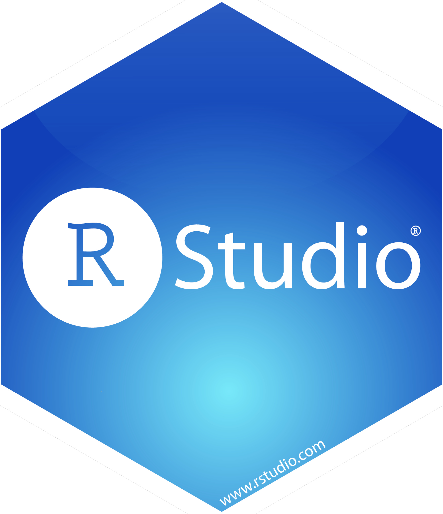

## R & Rstudio 

::: {layout="[70,30]"}

::: {first-column}
Si R est d’abord connu comme le logiciel mondial de référence en matière d’analyse statistique, il offre des fonctionnalités de plus en plus nombreuses à travers l’ajout régulier de nouveaux packages spécialisés qui permettent - entre autres- de faire de l’analyse de réseaux, de l’analyse textuelle, du traitement d’images, de la gestion de bases de données et enfin de la cartographie et du SIG. Même si le coût d’entrée dans ce logiciel demeure plus élevé que celui d’autres logiciels de statistiques – car il suppose d’apprendre les bases de la programmation – il offre à long terme des perspectives particulièrement intéressantes d’intégration de chaînes de traitement combinant des étapes généralement effectuées avec des logiciels différents. 
:::

::: {second-column}
{width=200}
:::

:::

::: {layout="[70,30]"}

::: {first-column}
L’intégration offerte par R ne concerne pas uniquement les étapes de traitement statistique et cartographique, mais aussi la production de documents finaux grâce à l’environnement R studio. Celui-ci permet à l’utilisateur de rédiger des documents (cours, TD, articles scientifiques), des présentations (diaporamas) ou même des sites web interactifs en utilisant un unique langage d’écriture (R markdown ou Quarto) où alternent des blocs de textes (comme dans Word) et des blocs de programme R générant des tableaux et des graphiques (comme dans Excel) et des cartes ou images (comme dans un SIG). 

:::

::: {second-column}
{width=200}
:::

:::

